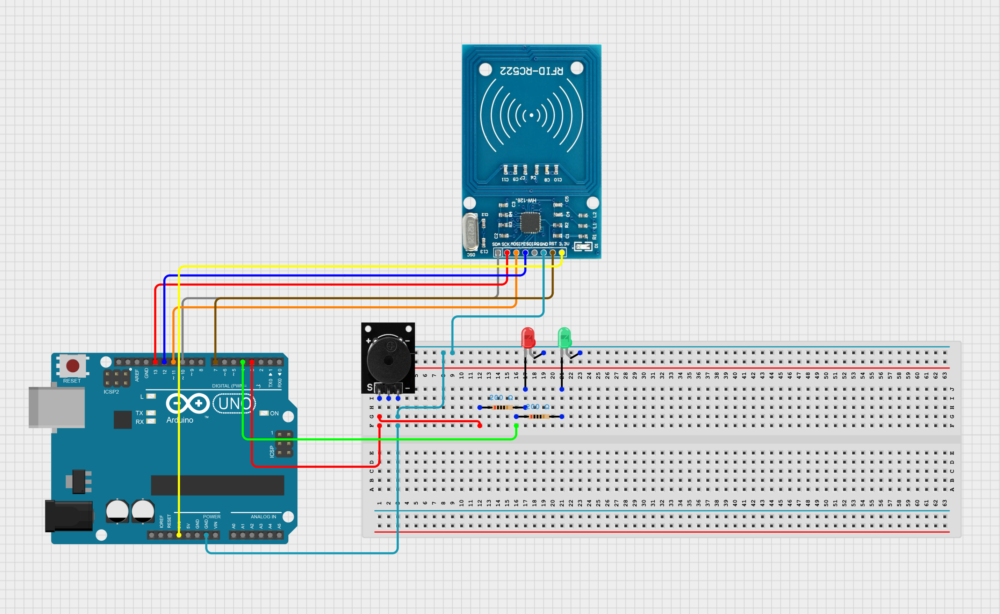

  NFC-Based Student Attendance System body { font-family: Arial, sans-serif; line-height: 1.6; margin: 0; padding: 0 20px; background-color: #f9f9f9; color: #333; } h1, h2, h3 { color: #222; } ul { margin: 10px 0; padding-left: 20px; } code { background-color: #e8e8e8; padding: 2px 4px; border-radius: 4px; font-family: "Courier New", Courier, monospace; } pre { background-color: #e8e8e8; padding: 10px; border-radius: 5px; overflow-x: auto; } a { color: #0066cc; text-decoration: none; } a:hover { text-decoration: underline; }

NFC-Based Student Attendance System
===================================

A streamlined solution to track and manage student attendance using NFC technology, Arduino, React Vite and Spring Boot as backend.

* * *

Table of Contents
-----------------

1.  [Overview](#overview)
2.  [Features](#features)
3.  [System Architecture](#system-architecture)
4.  [Technologies Used](#technologies-used)
5.  [Setup and Installation](#setup-and-installation)
6.  [Usage](#usage)
7.  [Contributing](#contributing)
8.  [License](#license)

* * *

Overview
--------

This project leverages **NFC scanning** and an **Arduino microcontroller** to create an automated system for recording student attendance. Scanned NFC tags are validated against a database managed by a Spring Boot application, making the attendance process fast, reliable, and scalable.

* * *

Features
--------

*   NFC tag scanning to identify students.
*   Integration with Spring Boot for backend processing.
*   Automatic recording of attendance in a database.
*   Flexible serial communication between Arduino and the server.
*   Toggleable LED indication on Arduino for successful/failed scans.
*   Upon scanning, immediate update of the frontend to show changes.

* * *

System Architecture
-------------------
A visualisation of the connections between the Arduino and NFC module, other components are : 
* Two LED's red and green.
* Two 200(value can vary but it is recommended between 200 and 500 ohms) ohm resistors.
* Active Buzzer to signal on wrong input.
* Jumping Cables.

### Components

1.  **NFC Scanner & Arduino**: Captures the NFC tag data and communicates with the backend.
2.  **Spring Boot Backend**:
    *   Validates NFC tag data.
    *   Manages database operations (CRUD for student attendance).
    *   Sends control commands to the Arduino via serial communication.
3.  **Database**: Stores student records and attendance logs.
4.  **React Vite Frontend**: Display real-time changes upon students scanning the NFC card.

* * *

Technologies Used
-----------------
1. **Hardware**:
   * Arduino Uno
   * MFRC522 NFC Module
   * Resistors
3.  **Software**:
    * Spring Boot - Backend services and REST API.
    * React Vite - Frontend showing the attendances of students.
    * MySQL - Relational database for managing attendance data.

* * *

Setup and Installation
----------------------

### Prerequisites

*   Arduino IDE installed ([download here](https://www.arduino.cc/en/software)).
*   Java Development Kit (JDK) 17 or later.
*   Spring Boot dependencies configured (Maven/Gradle).
*   Database (MySQL) installed and running.
*   jSerialComm and WebSocket library added to the Spring Boot project.

### Steps

1.  **Clone the Repository:**
    
        git clone https://github.com/Albionii/Student-Attendance-Management
    
2.  **Arduino Setup:**
    *   Upload the `arduino/NFC.ino` file to your Arduino using the Arduino IDE.
    *   Connect the components of Arduino as visualised above.
    *   Make sure you use port *COM5* and baud rate *9600* if not, you need to change these values on the main method of Spring App.
3.  **Backend Setup:**
    *   Open the project in your preferred IDE (e.g., IntelliJ IDEA or Eclipse).
    *   Configure the `application.properties` file to connect to your database.
    *   Start the Spring Boot application.
4.  **Run the System:**
    *   Run the backend and frontend apps.
    *   Test NFC scanning with your tags!

* * *

Usage
-----

### How it Works

1.  A student scans their NFC tag using the scanner.
2.  The Arduino reads the NFC tag UID and sends it to the backend.
3.  The backend validates the UID against the database.
4.  If valid:
    *   Attendance is recorded.
    *   A success signal is sent to Arduino, which toggles the green LED on for 2 seconds.
5.  If invalid:
    *   A failure signal is sent, and the red LED stays on for 2 seconds.

* * *
Contributing
------------

1.  Fork the repository.
2.  Create a feature branch:
    
        git checkout -b feature-name
    
3.  Commit your changes:
    
        git commit -m "Added a new feature"
    
4.  Push to the branch:
    
        git push origin feature-name
    
5.  Open a Pull Request.

* * *

License
-------

This project is licensed under the MIT License. See the `LICENSE` file for details.

* * *

